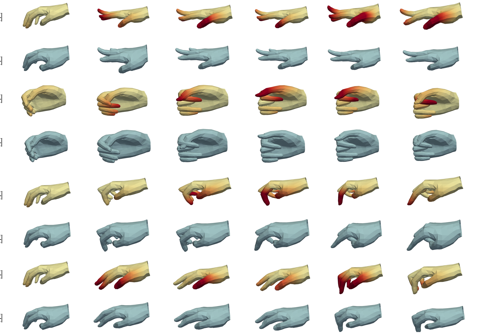

## 复杂手部姿态估计
#### 数据集 NinaproDB8 & NinaproDB5
#### 模型 DoubleDecoder.py

#### 代码结构
#### 数据集及相关引用
- [NinaproDB8](https://ninapro.hevs.ch/index.html)
- [NinaproDB5](https://ninapro.hevs.ch/index.html)
- [赛博手套校准代码](参考 Across-subject calibration of an instrumented glove to measure hand movement for clinical purposes)
- [manoTorch](https://github.com/lixiny/manotorch)
### 项目验证结果图
可以采用evaluate-> finaltest.py 进行验证
